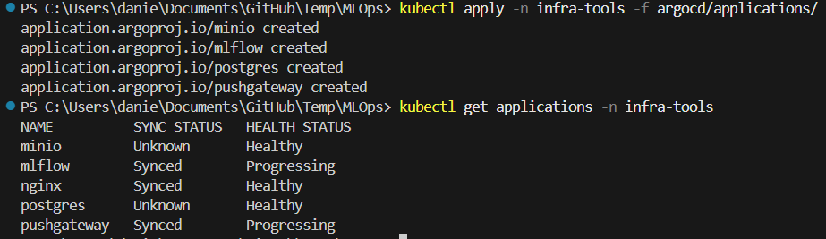

# Tier 3. Module 3 - MLOps CI/CD

## Homework for Topic 9 - Monitoring the quality of models and tracking experiments

### Deployment

This branch contains GitOps manifests and an experiment script that:

- Deploys MinIO, PostgreSQL, and an MLflow Tracking Server via ArgoCD;
- Deploys Prometheus Pushgateway via ArgoCD;
- Runs a small hyperparameter sweep on Iris and:
  - logs params/metrics/artifacts to MLflow;
  - pushes `mlflow_accuracy` and `mlflow_loss` to Pushgateway with `run_id` labels;
  - downloads the best model to `best_model/`.

#### Repo structure

```
MLOps/
├── argocd/
│   ├── applications/
│   │   ├── mlflow.yaml
│   │   ├── minio.yaml
│   │   ├── postgres.yaml
│   │   └── pushgateway.yaml
│   └── manifests/
│       └── mlflow/
│           ├── deployment.yaml
│           ├── service.yaml
│           └── secret.yaml
├── experiments/
│   ├── train_and_push.py
│   └── requirements.txt
├── best_model/
│   └── <downloaded model artifacts appear here after running>
└── README.md
```

#### Execution steps

After uploading the project to the repository, follow these steps.

1. Register Applications in ArgoCD

The repository itself was registered in the ArgoCD UI during the previous homework, see the branch [lesson-7](https://github.com/Matajur/MLOps/tree/lesson-7).

1.1 Apply ArgoCD Applications

Whenever you run the commands listed below, enter the name of your namespace instead of "infra-tools".

```bash
kubectl apply -n infra-tools -f argocd/applications/
```

This:

- Creates Application CRs in Kubernetes;
- Argo CD immediately detects them.

1.2 Verify Applications exist

```bash
kubectl get applications -n infra-tools
```



1.3 Log in to the ArgoCD UI to view applications' details

```bash
kubectl -n infra-tools port-forward svc/argocd-server 9090:80
```

How to get username and password for ArgoCD UI is explained in the previous homework, see the branch [lesson-7](https://github.com/Matajur/MLOps/tree/lesson-7).

2. mm

The MLflow server is exposed as a `ClusterIP` service in `mlflow` namespace (port `5000`).

Verify via port-forward:

```bash
kubectl -n mlflow port-forward svc/mlflow 5000:5000
curl -I http://localhost:5000
```

## 2) Deploy Prometheus Pushgateway via ArgoCD

```bash
kubectl apply -n argocd -f argocd/applications/pushgateway.yaml
```

Pushgateway will be available in-cluster at:

- `http://pushgateway.monitoring.svc.cluster.local:9091`

## 3) Run training and push metrics

From the repo root:

```bash
python -m venv .venv
source .venv/bin/activate
pip install -r experiments/requirements.txt

# In a separate terminal: keep port-forward active
kubectl -n mlflow port-forward svc/mlflow 5000:5000

python experiments/train_and_push.py \
  --tracking-uri http://localhost:5000 \
  --pushgateway http://pushgateway.monitoring.svc.cluster.local:9091
```

After completion, the best model artifacts will be downloaded into `best_model/`.

## 4) View metrics in Grafana

In **Grafana → Explore → Prometheus**, query:

- `mlflow_accuracy`
- `mlflow_loss`

Use table or time series view. Each pushed sample is labelled with `run_id`.
